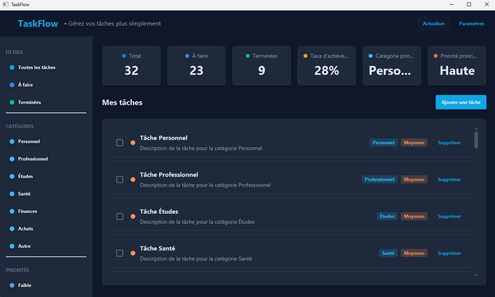
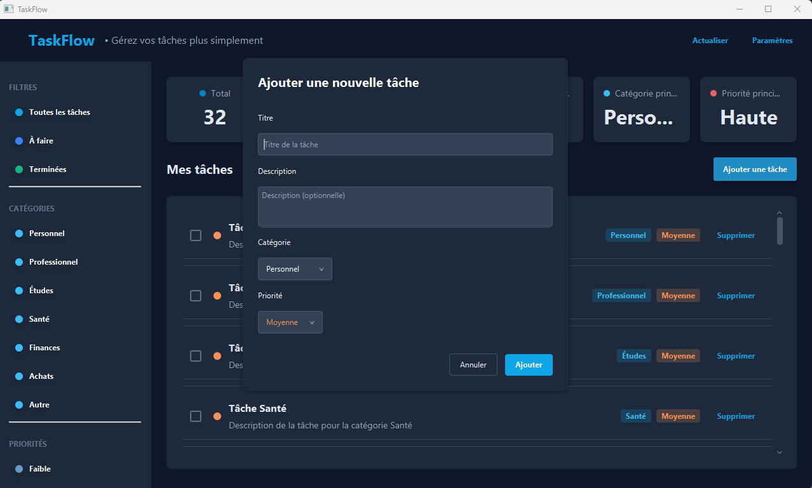

# TaskFlow

A task management application built with Java 8 and JavaFX, featuring a responsive Material Design-inspired interface.



## Current Features
- Task management (create, edit, delete, complete)
- Category and priority assignment
- Task filtering by status, category, and priority
- Statistics dashboard
- Local data storage (JSON format)
- Responsive layout



## Planned Enhancements
- Notifications and reminders
- Customizable themes
- Data export/import
- Search functionality
- Recurring tasks

## Technical Details
- **Language**: Java 8
- **UI Framework**: JavaFX
- **Build Tool**: Gradle
- **Dependencies**: JFoenix, GSON

## Setup

```bash
# Clone repository
git clone https://github.com/yourusername/taskflow.git

# Build project
gradle build

# Run application
gradle run
```

## Project Structure
- **Model**: Data classes (Task, Category, Priority)
- **View**: UI components
- **Controller**: Application logic
- **Service**: Data operations
- **Util**: Helper classes

## License
This project is licensed under the MIT License.